# MarketAgents
Agent based market simulation

MarketAgents is a microeconomic simulation framework designed to model agent-based market interactions. It includes features for simulating double auctions, tracking market dynamics, and modeling agent behavior. The framework is built to be extensible and adaptable for various economic experiments.

## Components

### MicroeconomicSystem
The core class responsible for running the simulation and generating reports. It integrates the `Environment` and `Institution` to manage the overall simulation process.

### Environment
Represents the simulation environment, including:
- **agents**: A list of `Agent` objects participating in the market.
- **commodities**: A list of `Commodity` objects available in the market.
- **time**: The current simulation time.
- **social_network**: An `AgentSocialNetwork` tracking interactions between agents.
- **information_board**: An `InformationBoard` for public messages and updates.

### Institution
Defines the rules and policies governing the market:
- **language**: Specifies the communication protocol and valid messages.
- **allocation_rules**: Rules for determining how resources are allocated.
- **cost_imputation_rules**: Rules for calculating costs associated with trades.
- **adjustment_process_rules**: Rules for adjusting the market state over time.

### Agent
The base class for all agents in the simulation:
- **id**: Unique identifier for the agent.
- **utility_function**: Function representing the agent's utility.
- **endowment**: The initial endowment of commodities.
- **rationality_coefficient**: Parameter defining the agent's rationality.
- **epsilon**: Parameter for balancing exploration and exploitation.
- **memory**: A `MarketMemory` object for storing historical market data.
- **send_message()**: Method to send messages to other agents.
- **receive_message()**: Method to receive messages from other agents.
- **make_decision()**: Method for making decisions based on current information.
- **update_strategy()**: Method to update the agent's strategy.

### Buyer
Subclass of `Agent` representing buyers:
- **induced_value**: Value the buyer assigns to a commodity.
- **income**: The buyer's available income.
- **demographic_characteristics**: Characteristics influencing buying behavior.
- **generate_bid()**: Method to generate a bid message.

### Seller
Subclass of `Agent` representing sellers:
- **induced_cost**: Cost of selling a commodity.
- **production_function**: Function for producing commodities.
- **capital**: Available capital for production.
- **specialization**: Area of expertise or specialization.
- **pricing_strategy**: Strategy for setting prices.
- **generate_ask()**: Method to generate an ask message.

### Commodity
Represents market commodities:
- **id**: Unique identifier for the commodity.
- **name**: Name of the commodity.
- **category**: Category of the commodity.
- **subcategory**: Subcategory of the commodity.

### ACLMessage
Represents messages exchanged between agents:
- **performative**: Type of performative (e.g., request, inform).
- **sender**: The sending agent.
- **receiver**: The receiving agent.
- **content**: The content of the message.
- **reply_with**: Identifier for a reply.
- **in_reply_to**: Identifier for the original message.
- **language**: Language used in the message.
- **ontology**: Ontology of the message.
- **protocol**: Protocol used for the message.
- **conversation_id**: Identifier for the conversation.

### Language
Defines the valid messages and protocols for communication between agents.

### AllocationRules
Contains rules for determining how resources are allocated based on bids and asks.

### CostImputationRules
Rules for calculating costs associated with trades.

### AdjustmentProcessRules
Rules for adjusting the market state, including start, transition, and stopping rules.

### DoubleAuction
Models the double auction mechanism:
- **buyers**: List of buyers participating in the auction.
- **sellers**: List of sellers participating in the auction.
- **order_book**: Maintains bids and asks for the auction.
- **trades**: List of trades executed during the auction.
- **start_auction()**: Starts the auction process.
- **end_auction()**: Ends the auction process.
- **process_message()**: Processes incoming messages.
- **match_orders()**: Matches bids and asks.
- **clear_market()**: Clears the market at the end of the auction.
- **broadcast_market_update()**: Broadcasts updates to all agents.

### OrderBook
Maintains a record of bids and asks:
- **bids**: List of bid messages.
- **asks**: List of ask messages.
- **add_order()**: Adds an order to the book.
- **remove_order()**: Removes an order from the book.
- **get_best_bid()**: Retrieves the best bid.
- **get_best_ask()**: Retrieves the best ask.

### Trade
Represents a trade between a buyer and a seller:
- **buyer**: The buyer involved in the trade.
- **seller**: The seller involved in the trade.
- **price**: Price of the trade.
- **quantity**: Quantity traded.
- **timestamp**: Time of the trade.

### MarketMemory
Stores historical market data:
- **price_history**: History of prices for each commodity.
- **trade_history**: History of trades.
- **agent_behavior**: Records of agent behavior and messages.
- **market_trends**: Current market trends for each commodity.
- **add_price()**: Adds a price record.
- **add_trade()**: Adds a trade record.
- **add_agent_behavior()**: Adds a record of agent behavior.
- **update_market_trends()**: Updates market trends based on new data.
- **get_relevant_market_data()**: Retrieves relevant market data.

### PricingStrategy
Defines the strategy for setting prices based on costs and market conditions.

### InformationBoard
Public board for broadcasting messages:
- **posts**: List of posted messages.
- **add_post()**: Adds a post to the board.
- **get_relevant_posts()**: Retrieves relevant posts for an agent.
- **retrieve_information()**: Retrieves general information from the board.

### Expression
Handles evaluation of expressions in ACL messages.

### AgentSocialNetwork
Models the social network of agents:
- **graph**: Directed graph of agent interactions.
- **add_interaction()**: Adds an interaction between agents.
- **get_interactions()**: Retrieves all interactions.
- **get_agent_neighbors()**: Retrieves neighbors of a specific agent.

```mermaid
classDiagram
    class Environment {
        +agents: List[Agent]
        +commodities: List[Commodity]
        +time: int
        +social_network: Graph
        +information_board: InformationBoard
    }
    class Institution {
        +language: Language
        +allocation_rules: AllocationRules
        +cost_imputation_rules: CostImputationRules
        +adjustment_process_rules: AdjustmentProcessRules
        +policy_rate: float
        +taxation_policy: float
        +business_regulation_index: float
        +social_security_index: float
    }
    class MicroeconomicSystem {
        +environment: Environment
        +institution: Institution
        +run_simulation()
        +generate_reports()
    }
    class Agent {
        +id: int
        +utility_function: Function
        +endowment: Dict[Commodity, float]
        +rationality_coefficient: float
        +epsilon: float
        +memory: MarketMemory
        +send_message(message: ACLMessage)
        +receive_message(message: ACLMessage)
        +make_decision()
        +update_strategy()
        +learn_from_experience()
        +adapt_strategy()
    }
    class Buyer {
        +induced_value: float
        +income: float
        +demographic_characteristics: Dict
        +generate_bid(): ACLMessage
        +calculate_utility(): float
    }
    class Seller {
        +induced_cost: float
        +production_function: Function
        +capital: float
        +specialization: str
        +pricing_strategy: PricingStrategy
        +generate_ask(): ACLMessage
        +optimize_production(): float
    }
    class Commodity {
        +id: int
        +name: str
        +category: str
        +subcategory: str
    }
    class ACLMessage {
        +performative: str
        +sender: Agent
        +receiver: Agent
        +content: Expression
        +reply_with: str
        +in_reply_to: str
        +language: str
        +ontology: str
        +protocol: str
        +conversation_id: str
    }
    class Language {
        +valid_messages: List[str]
    }
    class AllocationRules {
        +determine_allocation(bids: List[ACLMessage], asks: List[ACLMessage]): List[Trade]
    }
    class CostImputationRules {
        +calculate_costs(trades: List[Trade])
    }
    class AdjustmentProcessRules {
        +start_rule()
        +transition_rule()
        +stopping_rule()
    }
    class DoubleAuction {
        +buyers: List[Buyer]
        +sellers: List[Seller]
        +order_book: OrderBook
        +trades: List[Trade]
        +start_auction()
        +end_auction()
        +process_message(message: ACLMessage)
        +match_orders()
        +clear_market()
        +broadcast_market_update()
    }
    class OrderBook {
        +bids: List[ACLMessage]
        +asks: List[ACLMessage]
        +add_order(order: ACLMessage)
        +remove_order(order: ACLMessage)
        +get_best_bid(): ACLMessage
        +get_best_ask(): ACLMessage
        +update_order_book()
    }
    class Trade {
        +buyer: Buyer
        +seller: Seller
        +price: float
        +quantity: int
        +timestamp: datetime
    }
    class MarketMemory {
        +price_history: Dict[Commodity, List[float]]
        +trade_history: List[Trade]
        +agent_behavior: Dict[Agent, List[ACLMessage]]
        +market_trends: Dict[Commodity, str]
        +add_price(commodity: Commodity, price: float)
        +add_trade(trade: Trade)
        +add_agent_behavior(agent: Agent, message: ACLMessage)
        +update_market_trends()
        +get_relevant_market_data(context: str)
        +log_trade(trade: Trade)
    }
    class InformationBoard {
        +posts: List[ACLMessage]
        +add_post(post: ACLMessage)
        +get_relevant_posts(agent: Agent): List[ACLMessage]
        +retrieve_information()
    }
    MicroeconomicSystem *-- Environment
    MicroeconomicSystem *-- Institution
    Environment *-- Agent
    Environment *-- Commodity
    Environment *-- InformationBoard
    Agent <|-- Buyer
    Agent <|-- Seller
    Agent -- ACLMessage
    Agent *-- MarketMemory
    Institution *-- Language
    Institution *-- AllocationRules
    Institution *-- CostImputationRules
    Institution *-- AdjustmentProcessRules
    DoubleAuction *-- Buyer
    DoubleAuction *-- Seller
    DoubleAuction *-- OrderBook
    DoubleAuction *-- Trade
    InformationBoard *-- ACLMessage
```

