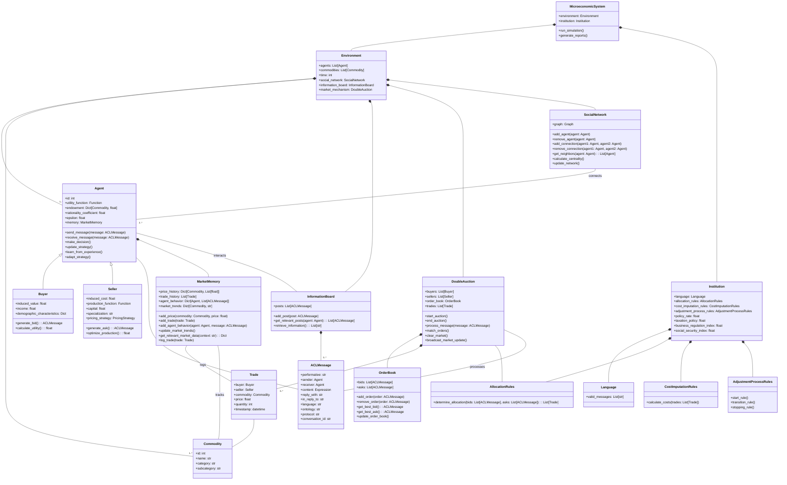

# MarketAgents
Agent based market simulation

MarketAgents is a microeconomic simulation framework designed to model agent-based market interactions. It includes features for simulating double auctions, tracking market dynamics, and modeling agent behavior. The framework is built to be extensible and adaptable for various economic experiments. This library is designed for implementing turn-based Double Auction simulations with literate economic agents capable of reading/writing news and communicating with each other. The library aims to study the role of news and information processing in the pricing dynamics of simulated virtual financial markets. Traditional economic models have struggled to acknowledge the role of information networks in price formation beyond simplistic implementations due to the inability to model human communication using natural language. The latest generation of LLMs now makes this possible.

This library seeks to merge and validate formal economic models of trade and learning with recent agent-based modeling capabilities. Large language models can implement, model, and formalize three fundamental aspects of realistic economic agents that have been known weaknesses of traditional economic models:

1. Information and communication beyond prices
2. In-context learning mimicking human behavior exhibited in experiments and actual markets
3. Bounded rationality through context overflow management and prompting choices

We anchor our simulation environment to the theoretical framework for modeling human experiments as Microeconomic Systems proposed by Nobel laureate Vernon L. Smith (1982). This framework's extensive use of information theory terminology offers an immediate connection to modern LLM theory and practice.

## Microeconomic Systems

A microeconomic system is a framework for modeling economic interactions between agents. It consists of two main components: an environment and an institution. The environment defines the characteristics of the economic agents, including their preferences, endowments, and technologies. The institution specifies the rules governing how agents can communicate and exchange goods or services. This framework allows economists to study how different environmental conditions and institutional rules impact economic outcomes and agent behavior.


## Double Auction

Double auctions are a specific type of microeconomic system commonly used in experimental economics and financial markets. In a double auction, buyers and sellers can simultaneously submit bids and offers for a single type of good. The environment typically consists of separate buyer and seller populations, each with their own induced values or costs for the good. The institutional rules allow participants to freely announce bids and offers, with trades occurring when a bid meets or exceeds an offer. This structure facilitates price discovery and efficient allocation of resources, making double auctions a powerful tool for studying market dynamics and testing economic theories.


| Proposition | Description |
|-------------|-------------|
| 4 | Allocations and prices in DA converge to levels near the competitive equilibrium (C.E.) prediction. This convergence is rapid, occurring in three to four trading periods or less with experienced subjects. |
| 5 | Convergence to C.E. prices and allocations occurs with as few as six to eight agents, and as few as two sellers. |
| 6 | Complete information on the theoretical supply and demand conditions is neither necessary nor sufficient for the rapid convergence property in DA. |
| 7 | Price convergence tends to be from above (below) the C.E. price when consumer's surplus is greater (smaller) than producer's surplus. |
| 8 | Experiments with one seller and five buyers do not achieve monopoly outcomes in DA, although some replications achieve the C.E. outcome. Buyers tend to withhold purchases, giving the seller a reduced profit. |
| 9 | Experiments with four buyers and four sellers where sellers (or buyers) are allowed to "conspire" do not converge to the monopoly (or monopsony) outcome in DA; neither do they seem to converge dependably to the C.E. |
| 10 | Binding price ceilings (floors) in DA yield contract price sequences which converge to the ceiling price from below (above). Non-binding price controls affect price dynamics but ultimately converge to C.E. |
| 11 | Asset markets with eight or nine agents in DA converge slowly toward the C.E. (rational expectations) price and efficiency. Convergence is hastened by introducing a futures market. |
| 12 | Asset markets with nine or twelve agents in DA, where some agents have insider information, converge toward the C.E. (rational expectations) price and efficiency. |

The table above summarizes key propositions from Vernon Smith's experimental studies on double auctions. These propositions highlight the robustness and efficiency of double auction markets under various conditions. Our aim is to replicate and potentially extend these findings using simulated agents, exploring how different levels of agent sophistication impact market dynamics and outcomes.

## Agents

n our simulation, we implement three distinct types of agents, each representing a different level of sophistication in decision-making and information processing. This approach allows us to compare market outcomes across a spectrum of agent capabilities, from the simplest random behavior to complex, language-model-driven strategies. By doing so, we can investigate how different degrees of agent intelligence and information processing affect market efficiency, price discovery, and the replication of empirical findings from human experiments. The three agent types are designed to capture key aspects of economic decision-making, from baseline random behavior to sophisticated, human-like reasoning.

### Zero Intelligence Agents

Zero Intelligence (ZI) agents represent the simplest form of market participants. These agents operate without strategic reasoning or learning capabilities. Instead, they generate random bids or asks within their budget constraints. ZI agents serve as a baseline model, demonstrating the minimum level of "intelligence" required for market function. Despite their simplicity, studies have shown that markets populated by ZI agents can still achieve near-efficient outcomes, highlighting the power of market institutions in guiding allocation decisions. These agents are particularly useful for isolating the effects of market structure from individual strategic behavior.

### Lookback Bayesian Agents

Lookback Bayesian agents introduce a level of strategic reasoning based on historical market data. These agents maintain a prior distribution of beliefs about market conditions and update these beliefs as new information becomes available. They make decisions by calculating expected values based on their current beliefs, effectively learning from past market outcomes. This approach allows for more sophisticated trading strategies that adapt to changing market conditions. Lookback Bayesian agents can capture phenomena such as price trend following or mean reversion, depending on their specific implementation. Their behavior more closely mimics real-world traders who use historical data to inform their decisions.

### LLM Agents

Large Language Model (LLM) agents represent the cutting edge in agent-based modeling for economic simulations. These agents leverage the power of language models to process complex information, learn in context, and make nuanced decisions. LLM agents can read and generate human-like messages, allowing for rich information exchange beyond simple price signals. Their working memory and history window can be adjusted to model different levels of bounded rationality. By controlling compression and summarization levels, we can simulate varying degrees of information processing capabilities. LLM agents can potentially exhibit sophisticated behaviors such as strategic communication, complex reasoning about market conditions, and adaptive learning that more closely resembles human decision-making in real markets.

# ACL Message Protocol in Multi-Agent Economic Simulation

In the context of a multi-agent economic simulation, particularly within a Double Auction framework, the Agent Communication Language (ACL) protocol plays a crucial role in facilitating interactions among agents. The ACL protocol, as defined by the Foundation for Intelligent Physical Agents (FIPA), provides a standardized method for agents to exchange information and perform actions in a consistent and interpretable manner.

## Key Components of ACL Messages

1. **Performative**: This field specifies the type of communicative act being performed, such as a request, inform, propose, or confirm. Each performative represents a different intention behind the message, guiding the receiving agent's response.

2. **Sender and Receiver**: These fields identify the agents involved in the communication. The sender field specifies the agent that initiates the message, while the receiver field indicates the intended recipient.

3. **Content**: The content field contains the actual information or request being communicated. This can be a simple string, a structured data format, or a complex expression in a formal language or ontology.

4. **Reply With and In Reply To**: These fields are used to manage conversations. The reply_with field provides a unique identifier for the message, which can be referenced by the in_reply_to field in subsequent messages to link replies to their original messages.

5. **Language and Ontology**: These fields define the syntax and semantics of the content. The language field specifies the formal language used to represent the content, while the ontology field defines the domain-specific vocabulary and concepts.

6. **Protocol**: This field indicates the interaction protocol being followed, ensuring that both agents understand the expected sequence of communicative acts.

7. **Conversation ID**: This field uniquely identifies a conversation thread, allowing agents to track and manage multiple ongoing interactions simultaneously.

## Example Usage in a Double Auction Framework

In a Double Auction framework, ACL messages facilitate various market interactions, such as submitting bids and offers, negotiating trades, and disseminating market information. Here is a typical example of how ACL messages are used in this context:

1. **Bid Submission**:
   * **Performative**: `PROPOSE`
   * **Sender**: `BuyerAgent1`
   * **Receiver**: `AuctioneerAgent`
   * **Content**: `{"commodity": "gold", "price": 1500, "quantity": 10}`
   * **Language**: `JSON`
   * **Ontology**: `MarketOntology`
   * **Protocol**: `DoubleAuctionProtocol`
   * **Conversation ID**: `conv1`

2. **Offer Submission**:
   * **Performative**: `PROPOSE`
   * **Sender**: `SellerAgent1`
   * **Receiver**: `AuctioneerAgent`
   * **Content**: `{"commodity": "gold", "price": 1550, "quantity": 5}`
   * **Language**: `JSON`
   * **Ontology**: `MarketOntology`
   * **Protocol**: `DoubleAuctionProtocol`
   * **Conversation ID**: `conv1`

3. **Trade Confirmation**:
   * **Performative**: `ACCEPT_PROPOSAL`
   * **Sender**: `AuctioneerAgent`
   * **Receiver**: `BuyerAgent1, SellerAgent1`
   * **Content**: `{"commodity": "gold", "price": 1525, "quantity": 5}`
   * **Language**: `JSON`
   * **Ontology**: `MarketOntology`
   * **Protocol**: `DoubleAuctionProtocol`
   * **Conversation ID**: `conv1`

4. **Market Update**:
   * **Performative**: `INFORM`
   * **Sender**: `AuctioneerAgent`
   * **Receiver**: `AllAgents`
   * **Content**: `{"update": "new_trade", "commodity": "gold", "price": 1525, "quantity": 5}`
   * **Language**: `JSON`
   * **Ontology**: `MarketOntology`
   * **Protocol**: `DoubleAuctionProtocol`
   * **Conversation ID**: `market_update1`

## CONTEXT MEMORIES FOR PIPING INTO AGENT PROMPTS

Depending on the resolution the agents need, we should use a fast indexed search for fast recall of distant memories.

### Agent Context Memory:

1. *inner_monologue:* reflections on {activity_log} their {stats} and {mood}. reassess current {goals}.
2. *finance_history:* {transaction_history} {account balance} {assets}
3. *social_history:* {p2p chats with other agents} {chatroom/messageboard interactions}
4. *activity_log:* {sims sequence of their mundane tasks} {recent_actions} {needs_stats} {mood}

Has four distinct memory logs, masking some context while emphasising others through prompting. 

### Financial Observor/and or Environment Context Memory:

1. *market_history:* {all_trades} {global_price} {global_supply_demand} {economic_indicators}
2. *observation_history:* {market_trends} {commentary} {agent_behaviour} {market_history} {chatlogs}

Has two memory tracks their previous observations and the holistic market overview.  

### Trackables:
```
personal_trade_history: A list of trades the agent has participated in.
commodity_price_history: Historical prices for each commodity the agent has interacted with.
past_decisions: A record of decisions made, including context and outcomes.
strategy_performance: Metrics on how well different strategies have performed.
social_interactions: A record of interactions with other agents.
market_beliefs: The agent's beliefs about different commodities in the market.
learning_experiences: Specific scenarios where the agent has learned something.
utility_history: A record of the agent's utility over time.
endowment_history: How the agent's endowment has changed over time.
message_history: A record of messages sent and received.
global_price_history: Historical prices for all commodities in the market.
all_trades: A record of all trades that have occurred in the market.
market_trends: Overall trends for each commodity.
agent_behaviors: Summary of behaviors for each agent in the market.
institution_changes: Record of changes to market institutions and their impacts.
global_supply_demand: Supply and demand information for each commodity.
economic_indicators: Various economic indicators relevant to the market.
```

### Information Board
The Information Board serves as a centralized repository for economic news and statistics, simulating the dissemination of public information within the economy. This component plays a crucial role in the MarketAgents framework by:

1. Generating and distributing economic news based on current market states and exogenous factors.
2. Implementing information dissemination mechanisms with variable reach and impact.
3. Simulating information decay and relevance scoring to model the changing importance of information over time.

The Information Board allows for the study of how information flow affects market dynamics and agent decision-making, providing a more realistic simulation of information asymmetry and its effects on economic outcomes.

### Social Network Graph
The social network component in the MarketAgents framework models the interconnections and relationships between agents in the simulated economy. It plays a crucial role in capturing the effects of social interactions, information diffusion, and network externalities on market dynamics. The social network influences how information spreads, how agents form opinions, and how they make economic decisions based on their connections.

## Core Modules

### MicroeconomicSystem
The MicroeconomicSystem class serves as the main controller for the simulation, integrating the environment and institution components.

Key Attributes:
- `environment`: Environment
- `institution`: Institution

Key Methods:
- `run_simulation()`
- `generate_reports()`

### Environment
The Environment class represents the economic context in which agents operate.

Key Attributes:
- `agents`: List[Agent]
- `commodities`: List[Commodity]
- `time`: int
- `social_network`: Graph
- `information_board`: InformationBoard

### Institution
The Institution class defines the rules and structures governing economic interactions.

Key Attributes:
- `language`: Language
- `allocation_rules`: AllocationRules
- `cost_imputation_rules`: CostImputationRules
- `adjustment_process_rules`: AdjustmentProcessRules
- `policy_rate`: float
- `taxation_policy`: float
- `business_regulation_index`: float
- `social_security_index`: float

### Agent
The Agent class serves as the base class for economic actors in the simulation.

Key Attributes:
- `id`: int
- `utility_function`: Function
- `endowment`: Dict[Commodity, float]
- `rationality_coefficient`: float
- `epsilon`: float
- `memory`: MarketMemory

Key Methods:
- `send_message(message: ACLMessage)`
- `receive_message(message: ACLMessage)`
- `make_decision()`
- `update_strategy()`
- `learn_from_experience()`
- `adapt_strategy()`

#### Buyer
The Buyer class represents agents who purchase commodities.

Key Attributes:
- `induced_value`: float
- `income`: float
- `demographic_characteristics`: Dict

Key Methods:
- `generate_bid(): ACLMessage`
- `calculate_utility(): float`

#### Seller
The Seller class represents agents who sell commodities.

Key Attributes:
- `induced_cost`: float
- `production_function`: Function
- `capital`: float
- `specialization`: str
- `pricing_strategy`: PricingStrategy

Key Methods:
- `generate_ask(): ACLMessage`
- `optimize_production(): float`

### Commodity
The Commodity class represents the goods or services traded in the market.

Key Attributes:
- `id`: int
- `name`: str
- `category`: str
- `subcategory`: str

### Market Mechanisms

#### DoubleAuction
The DoubleAuction class implements the double auction market mechanism.

Key Attributes:
- `buyers`: List[Buyer]
- `sellers`: List[Seller]
- `order_book`: OrderBook
- `trades`: List[Trade]

Key Methods:
- `start_auction()`
- `end_auction()`
- `process_message(message: ACLMessage)`
- `match_orders()`
- `clear_market()`
- `broadcast_market_update()`

#### OrderBook
The OrderBook class manages the list of bids and asks in the market.

Key Attributes:
- `bids`: List[ACLMessage]
- `asks`: List[ACLMessage]

Key Methods:
- `add_order(order: ACLMessage)`
- `remove_order(order: ACLMessage)`
- `get_best_bid(): ACLMessage`
- `get_best_ask(): ACLMessage`
- `update_order_book()`

### Communication Protocol

#### ACLMessage
The ACLMessage class implements the FIPA Agent Communication Language specification.

Key Attributes:
- `performative`: str
- `sender`: Agent
- `receiver`: Agent
- `content`: Expression
- `reply_with`: str
- `in_reply_to`: str
- `language`: str
- `ontology`: str
- `protocol`: str
- `conversation_id`: str

### Data Collection and Analysis

#### MarketMemory
The MarketMemory class maintains historical records of market activities.

Key Attributes:
- `price_history`: Dict[Commodity, List[float]]
- `trade_history`: List[Trade]
- `agent_behavior`: Dict[Agent, List[ACLMessage]]
- `market_trends`: Dict[Commodity, str]

Key Methods:
- `add_price(commodity: Commodity, price: float)`
- `add_trade(trade: Trade)`
- `add_agent_behavior(agent: Agent, message: ACLMessage)`
- `update_market_trends()`
- `get_relevant_market_data(context: str): Dict`
- `log_trade(trade: Trade)`

#### InformationBoard
The InformationBoard class serves as a centralized repository for economic news and statistics.

Key Attributes:
- `posts`: List[ACLMessage]

Key Methods:
- `add_post(post: ACLMessage)`
- `get_relevant_posts(agent: Agent): List[ACLMessage]`
- `retrieve_information(): List[str]`

#### ocialNetwork
The SocialNetwork class represents the social structure of the agents in the simulation. It uses a graph data structure to model connections between agents and provides methods for manipulating and analyzing the network.

Key Attributes:
- `graph: Graph - The underlying graph structure representing agent connections`

Key Methods:

- `add_agent(agent: Agent): Adds a new agent to the social network`
- `remove_agent(agent: Agent): Removes an agent from the social network`
- `add_connection(agent1: Agent, agent2: Agent): Creates a connection between two agents`
- `remove_connection(agent1: Agent, agent2: Agent): Removes the connection between two agents`
- `get_neighbors(agent: Agent): List[Agent]: Returns a list of agents connected to the given agent`
- `calculate_centrality(): Computes various centrality measures for agents in the network`
- `update_network(): Updates the network structure based on agent interactions and market events`

### Additional Components

#### Language
The Language class defines the valid messages and communication rules.

Key Attributes:
- `valid_messages`: List[str]

#### AllocationRules
The AllocationRules class determines how resources are allocated based on market interactions.

Key Methods:
- `determine_allocation(bids: List[ACLMessage], asks: List[ACLMessage]): List[Trade]`

#### CostImputationRules
The CostImputationRules class defines how costs are calculated and assigned.

Key Methods:
- `calculate_costs(trades: List[Trade])`

#### AdjustmentProcessRules
The AdjustmentProcessRules class governs how the market adjusts over time.

Key Methods:
- `start_rule()`
- `transition_rule()`
- `stopping_rule()`

#### Trade
The Trade class represents a completed transaction between a buyer and a seller.

Key Attributes:
- `buyer`: Buyer
- `seller`: Seller
- `price`: float
- `quantity`: int
- `timestamp`: datetime


